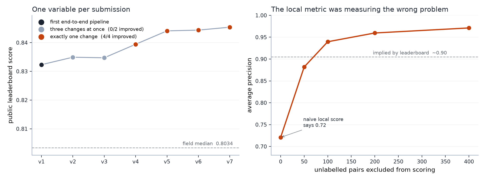

# Detecting collusion in online poker

Detecting pairs of online poker players who are secretly transferring money to
each other — across 2,000,000 hands, 18,609,028 individual actions and 12,000
players — then classifying *how* they did it and citing the five hands that
prove it.

Built for the Kaggle competition
[Detect Suspicious Value Transfers in Poker](https://www.kaggle.com/competitions/detect-suspicious-value-transfers-in-poker)
($5,000 prize pool).

**Placed 109th with a score of 0.84537**, in a competition that drew 4,775
submissions. The median entry scored 0.8034.

`Python` · `CatBoost` · `Polars` · `scikit-learn` · `NumPy` / `pandas` ·
positive-unlabelled learning · learning-to-rank (YetiRank) · grouped
cross-validation



## The problem

Colluding players don't cheat in ways a rule can catch. They fold winning hands
to each other, decline to raise when they could, and squeeze a third player
between them. Any one hand looks like an ordinary mistake. Only the pattern
across hundreds of shared hands separates a cheat from a bad player.

Each of 112,540 candidate player-pairs needs three predictions, scored as
`0.70 × pair AP + 0.20 × evidence MAP@5 + 0.10 × behaviour macro-AP`:

| Component | Weight | What it asks |
|---|---|---|
| Risk score | 70% | How likely is this pair colluding? |
| Evidence | 20% | Which five hands demonstrate it? |
| Behaviour | 10% | Which of three collusion patterns is it? |

**The hard part is the labels.** Only 1,860 of 137,739 development pairs are
labelled at all, and just 372 of those are positive. Everything else is
unlabelled — and an unknown slice of it is colluding. This is a
positive-unlabelled problem wearing a supervised problem's clothes, and
treating it as supervised is what breaks the validation (below).

## How it works

```
raw hands ─▶ pair-hand features ─▶ pair aggregates ─┬─▶ risk model      (70%)
             (identity-free,                        ├─▶ evidence ranker (20%)
              permutation-symmetric)                └─▶ behaviour model (10%)
```

**Features are built so the model cannot learn player identity.** Every
pair-hand feature is symmetric under swapping the two players and invariant to
renaming them — enforced by unit tests, not convention. Four families:

- **Value transfer** — who ends up with the chips, and did the chip flow follow hand strength?
- **Entry policy** — each player's own baseline looseness, so "played a weak hand" is scored against *that player's* norm rather than a global one.
- **Hindsight** *(training only)* — the hole cards of folded players reveal whether a fold surrendered a winning hand, and who was the victim of an isolation squeeze.
- **Action-local context** — did the yield happen *immediately* after the partner acted? Are the roles consistent across hands, or do they alternate?

**Models.** Gradient-boosted trees (CatBoost) throughout. Risk is a classifier
trained with PU sample weights (8 confirmed positive / 1 confirmed negative /
0.15 unlabelled). Evidence is a `CatBoostRanker` with YetiRank loss, grouped by
pair, then blended per behaviour family in rank space. A generic risk model is
blended with three per-family specialists.

**Leakage control.** Folds are assigned by `SHA256(table_id) % 5`, so players who
share a table never straddle a fold boundary. Fold 0 is a lockbox, untouched
until the final configuration was frozen. One assembly path (`pipeline.py`)
serves both training and inference, so the two cannot silently drift apart.

## Results

| Submission | What changed | Public |
|---|---|---|
| v1 | first end-to-end pipeline | 0.83232 |
| v2 | three changes at once | 0.83492 |
| v3 | three changes at once | 0.83472 |
| v4 | evidence only: context-feature blend | 0.83942 |
| v5 | risk only: family-specialist blend | 0.84409 |
| v6 | evidence only: per-family blend weight | 0.84436 |
| **v7** | **risk only: context features into the risk model** | **0.84537** |

Every submission that changed exactly one thing improved. Neither submission
that changed three things at once did — and because three variables moved
together, neither could be diagnosed afterwards. That is the most useful thing
this project taught me, and it cost more than any modelling decision.

## Two findings worth reading even if you don't care about poker

### 1. The obvious validation metric was measuring the wrong problem

Scoring locally the natural way — every unlabelled pair counted as innocent —
gave 0.72 while the leaderboard implied ~0.90. That gap is structural, not
noise. Development labels 1.3% of pairs, so a model that correctly flags an
*undisclosed* colluder is punished for it, while the real solution labels every
colluding pair and rewards exactly that.

Excluding the most suspicious unlabelled pairs from scoring closes the gap
(right-hand panel above), which brackets the true value instead of pretending
to a point estimate. **Judged at censor-0 alone, the change that produced the
single largest gain would have been rejected** — it looked like a regression
(0.7323 → 0.7242) while improving every censored level.

### 2. Collusion does not persist across the phase boundary

99.94% of the pairs to be scored also played together during the training
window, a median of 99 hands each. That looks like free extra data and it is
the first thing you'd reach for. A pair's behaviour in one phase predicts its
label in the other at **AP 0.198 against a base rate of 0.200** — indistinguishable
from noise. Testing the attractive hypothesis first cost an afternoon and
avoided building a feature set that would have diluted the real signal.

## What didn't work

Recorded with numbers in [`OPUS_HANDOFF.md`](OPUS_HANDOFF.md), because the
negative results took as long to establish as the positive ones: phase pooling,
PU/spy relabelling of suspicious unlabelled pairs (0.712 → 0.692), seed
averaging the evidence rankers (actively harmful, 0.5171 → 0.5112), pooling
behaviour families for isolation (0.22 vs 0.28), reverse-engineering the
organisers' evidence-selection rule (best exact-set recovery 5/132), graded
relevance (0.500 → 0.477), and count-vs-rate features.

One problem stayed unsolved: `coordinated_isolation` evidence stuck at MAP 0.27
against 0.58 and 0.63 for the other two families. The diagnosis is written up
in the log; the fix isn't.

## Layout

```
src/
  prepare.py              partition raw hands, assign folds by hash of table_id
  features.py             identity-free, permutation-symmetric pair-hand features
  population.py           label-free entry-policy baselines and contrasts
  hindsight.py            what the cards actually were: folded winners, isolation victims
  context_features.py     action-local context: immediate yielding, role consistency
  pipeline.py             single assembly path for train and inference
  model.py                risk classifier, evidence ranker, behaviour model
  final.py                the frozen configuration: fit, lockbox, export
  validate_submission.py  13 pre-submission checks
tests/                    scoring contract + feature-invariance tests
reports/                  every experiment's metrics, including the failures
OPUS_HANDOFF.md           full working log: what was tried, what failed, and why
```

## Running it

Competition data is not included and must be downloaded from Kaggle.

```bash
pip install -r requirements.txt
python -m unittest discover -s tests   # 4 tests, no data required

python src/prepare.py          # partition, folds
python src/features.py         # pair-hand features
python src/population.py       # entry-policy features
python src/build_cache.py      # cache the assembled tables
python src/final.py            # fit and export
python src/validate_submission.py artifacts/final/submission.csv
```

Everything runs on an 8GB laptop; nothing here needs a GPU or paid compute.

Two caveats recorded honestly. Re-running the pipeline does not reproduce the
v2 predictions bit-for-bit, so the winning lineage builds on the file downloaded
back from Kaggle rather than a local rebuild. And the validation-metric finding
means every number in `reports/` should be read as a range, not a point.

## Notes

Written with AI assistance (Claude and GPT), which the commit history and the
working log both reflect. The experiment design, the negative results and the
two findings above are the substance; they are documented in enough detail to
be checked rather than taken on trust.

MIT licensed. Competition data is not redistributed here.
